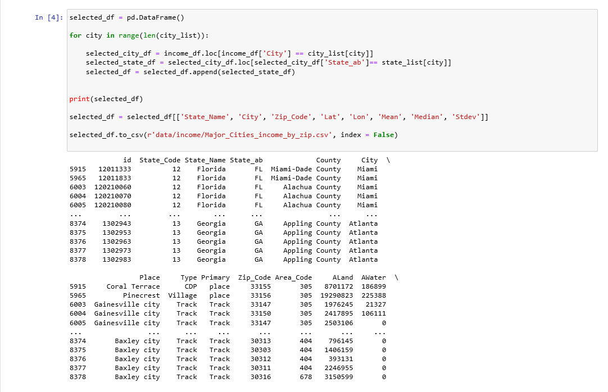
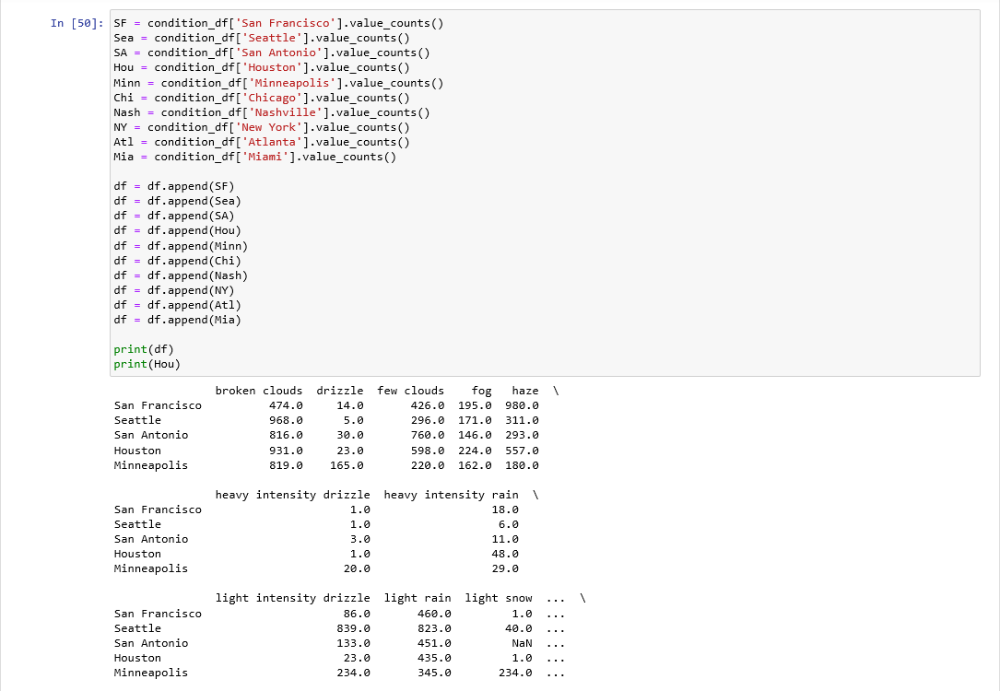

# Project1 
# USED CAR SALES IN 2017
*PPT Presentation,*
*Overview,*
*Running Code,*
*Figures,*
*Technologies used,*
*Sources,*
*Authors*

## PPT Presentation ##

## Overview ##
### Main Question ###
Is there any difference between geographic location (ie. weather, average income) and used car postings in 10 major cities across the US from 2017.
null hypothesis - There is no difference between geographic location and car sales.

### Cities picked ###
* Nashville, TN
* Atlanta, GA
* Miami, FL
* Houston, TX
* San Antonio, TX
* San Francisco, CA
* Seattle, WA
* Minneapolis, MN
* Chicago, IL
* New York, NY

## Running Codes - Some Examples ##
*Cleanning some data and exporting them in a csv file*

*Searching at specific data using loc function*

*Arrenging data using append function*

*Making plot bar after reading csv files*

*Making scatter plot after reading csv files*

## Figures (Some Examples) ##
%20by%20City.png)

%20vs%20Total%20listings%20by%20City.png)

## Technologies used ##
* Pandas Library: DataFrame.plot(), matplotlib, 
* Adobe Illustrator
* .cvs files - Excel

## Sources ##
TRUECar.com
Kagell: OpenWeather, Oak Research Group
Fema.org
  
## Authors ##
Sylvain David, Tony Gardella and Tony Samor - Data Analytics Bootcamp - Vanderbilt University - 2020
Illustrations by Sylvain David - All Rights Reserved - 2020